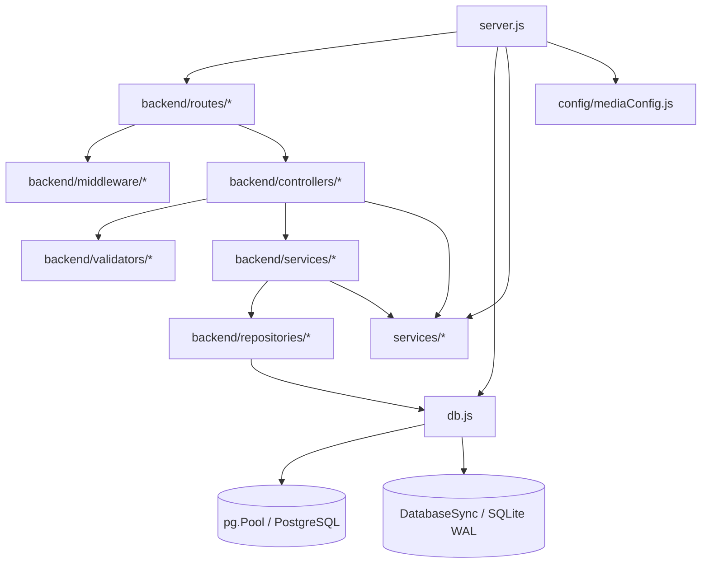

# DRAGME — Architectural Foundation Audit (v1.0)
**Document Status:** Complete Runtime Audit  
**Date:** 2026-10-03  
**Auditor:** DeepMind Antigravity AI (Pair Architect)  
**Target:** Clean Modular Monolith + Scalable Infrastructure Boundaries

---

## Executive Summary
This audit provides an exhaustive, evidence-based analysis of the runtime state, dependencies, legacy artifacts, duplications, infrastructure bounds, and code boundaries of the DRAGME codebase prior to the Foundation Refactor v1.

No code modifications were performed during this audit. Every finding is backed by direct code inspection and runtime execution.

---

## 1. Current Runtime Entrypoints

### Frontend Entrypoint
- **HTML Entrypoint:** [`index.html`](file:///c:/Users/nitis/Desktop/axh/index.html)
- **Runtime Module Bootstrap:** Loaded via `` at line 2881 of [`index.html`](file:///c:/Users/nitis/Desktop/axh/index.html).
- **Active Stylesheet:** Loaded via `<link rel="stylesheet" href="style.css?v=6.7">` at line 20 of [`index.html`](file:///c:/Users/nitis/Desktop/axh/index.html).

### Backend Entrypoint
- **Node.js HTTP Server:** [`server.js`](file:///c:/Users/nitis/Desktop/axh/server.js) executing Express 4.21.2 on `PORT` (default `5173`).
- **Database Engine Initialization:** [`db.js`](file:///c:/Users/nitis/Desktop/axh/db.js) initialized inside `startServer()` in [`server.js`](file:///c:/Users/nitis/Desktop/axh/server.js).
- **Background Queue & Workers:** `MediaQueue` and `MediaProcessor` periodic workers registered during server bootstrap in [`server.js`](file:///c:/Users/nitis/Desktop/axh/server.js).

---

## 2. Frontend Dependency Graph

```mermaid
graph TD
    HTML[index.html] --> CSS[style.css]
    HTML --> Main[src/main.js]
    
    Main --> AppStore[src/app/store.js]
    Main --> AppRouter[src/app/router.js]
    Main --> ApiClient[src/api/apiClient.js]
    
    Main --> SvcAvatar[src/services/avatarService.js]
    Main --> SvcSfx[src/services/sfxService.js]
    Main --> SvcAnim[src/services/animationScheduler.js]
    
    Main --> FeatAuth[src/features/auth/index.js]
    Main --> FeatNav[src/features/navigation/index.js]
    Main --> FeatFeed[src/features/feed/index.js]
    Main --> FeatPosts[src/features/posts/index.js]
    Main --> FeatComments[src/features/comments/index.js]
    Main --> FeatReactions[src/features/reactions/index.js]
    Main --> FeatProfile[src/features/profile/index.js]
    Main --> FeatToast[src/features/toast/toastManager.js]

    FeatAuth --> AuthApi[src/api/authApi.js]
    FeatFeed --> PostsApi[src/api/postsApi.js]
    FeatPosts --> MediaApi[src/api/mediaApi.js]
    FeatComments --> CommentsApi[src/api/commentsApi.js]
    FeatReactions --> ReactionsApi[src/api/reactionsApi.js]
    FeatProfile --> ProfilesApi[src/api/profilesApi.js]
    
    AuthApi --> ApiClient
    PostsApi --> ApiClient
    MediaApi --> ApiClient
    CommentsApi --> ApiClient
    ReactionsApi --> ApiClient
    ProfilesApi --> ApiClient
```

### Module Breakdown
1. **`src/app/`**: Application-level infrastructure (reactive state store, hash/history router, environment config).
2. **`src/api/`**: Unified API abstraction layer with error normalization, JWT token injection, and endpoint methods.
3. **`src/features/`**: Domain feature packages encapsulating DOM event binding, UI lifecycle, and business workflows:
   - `auth/`: Modal login, registration, guest-to-auth elevation, session check.
   - `navigation/`: Desktop top navbar, mobile bottom nav dock, responsive left navigation drawer.
   - `feed/`: Feed streams (For You, Following, Trending), post card renderer, scroll management.
   - `posts/`: Spring modal post composer, video/image upload, category picker, liquid identity pill.
   - `comments/`: Bottom sheet discussion drawer, replies, optimistic updates.
   - `reactions/`: Standard crown, super crown reaction engine, reactor modal lists.
   - `profile/`: User profile hub, edit profile modal, media studio management.
   - `toast/`: Notification toasts with spring easing.
4. **`src/services/`**: Client compute engines (SFX audio synthesizer, Avatar resolver, WebP canvas compressor, video autoplay scheduler).
5. **`src/constants/`**: Design tokens, categories, reaction types, room lists.
6. **`src/utils/`**: Safe DOM utilities (XSS escaping, event dispatching) and date formatting.

---

## 3. Backend Dependency Graph

### Layer Responsibilities
- **Routes (`backend/routes/`)**: Expose HTTP endpoints, bind path params, attach rate limiters and auth middleware.
- **Controllers (`backend/controllers/`)**: Parse HTTP headers/body/query, invoke services, serialize HTTP response envelopes.
- **Services (`backend/services/` & root `services/`)**: Enforce business validation, compute reactions, orchestrate media transcoding, and coordinate transactions.
- **Repositories (`backend/repositories/`)**: Encapsulate SQL queries and mapping records to clean domain objects.
- **Database (`db.js`)**: Universal SQL query adapter abstracting SQLite and PostgreSQL.

---

## 4. Legacy Code Audit

| File / Folder | Lines | Status | Reason & Findings |
|---|---|---|---|
| `app.js` (root) | 7,600 | **LEGACY (Retained as reference)** | Monolithic bundle created during early prototyping. Not imported in `index.html` (which loads `src/main.js`). Still served via fallback route in `server.js`. |
| `components/auth/auth.js` | 70 | **UNUSED / DUPLICATE** | Early prototype stub. Uses `console.log('[Auth] Open Login Dialog')`. Superseded by `src/features/auth/`. |
| `components/bottom-nav/bottom-nav.js` | 52 | **UNUSED / DUPLICATE** | Early prototype stub. Superseded by `src/features/navigation/bottomNav.js`. |
| `components/create-post-modal/create-post-modal.js` | 105 | **UNUSED / DUPLICATE** | Early prototype stub with `window.location.reload()`. Superseded by `src/features/posts/createPostModal.js`. |
| `components/feed/feed.js` | 199 | **UNUSED / DUPLICATE** | Early prototype stub with obsolete CSS classes. Superseded by `src/features/feed/feedManager.js`. |
| `components/feed/feed.html` | 85 | **UNUSED / TEMPLATE** | Standalone HTML card snippet. Not referenced at runtime. |
| `components/navbar/navbar.js` | 126 | **UNUSED / DUPLICATE** | Early prototype. Superseded by `src/features/navigation/navbar.js`. |
| `components/toast/toast.js` | 44 | **UNUSED / DUPLICATE** | Early prototype. Superseded by `src/features/toast/toastManager.js`. |

---

## 5. Duplicate Implementations Audit

1. **Auth Handling:**
   - Active: `src/features/auth/*` (`authManager.js`, `loginManager.js`, `signupManager.js`, `logoutManager.js`, `authPromptManager.js`).
   - Duplicate/Legacy: `components/auth/auth.js` & inline functions in `app.js`.
2. **Navigation & Modals:**
   - Active: `src/features/navigation/*` & `src/features/posts/createPostModal.js`.
   - Duplicate/Legacy: `components/navbar/navbar.js`, `components/bottom-nav/bottom-nav.js`, `components/create-post-modal/create-post-modal.js`.
3. **Feed & Cards:**
   - Active: `src/features/feed/feedManager.js`.
   - Duplicate/Legacy: `components/feed/feed.js`.
4. **Toast Alerts:**
   - Active: `src/features/toast/toastManager.js`.
   - Duplicate/Legacy: `components/toast/toast.js`.
5. **Services Layer Placement:**
   - Root `services/` (`mediaProcessor.js`, `storageService.js`, `mediaService.js`, `mediaQueue.js`, `mediaDeliveryService.js`) and `config/mediaConfig.js` exist at the top level while other services exist in `backend/services/`. Unifying them under a clear backend architecture will improve clarity.

---

## 6. Duplicate APIs Audit

- **API Routes:** All API endpoints are mounted in `server.js` under `/api` via dedicated routers (`authRoutes`, `profileRoutes`, `mediaRoutes`, `postRoutes`, `commentRoutes`, `roomRoutes`).
- **No Duplicate API routes found on the server.**
- **Client API Calls:** `src/api/` contains clean, modular API services (`authApi`, `postsApi`, `commentsApi`, `mediaApi`, `profilesApi`, `reactionsApi`, `roomsApi`) routing through a single `apiClient.js`.

---

## 7. Duplicate State Management Audit

- **Canonical State Store:** [`src/app/store.js`](file:///c:/Users/nitis/Desktop/axh/src/app/store.js) is the single reactive pub/sub store.
- **Legacy State in `app.js`:** Legacy global variables like `window.CURRENT_USER`, `window.ALL_POSTS`, etc. in `app.js` are not loaded or active at runtime.
- **Clean Bridge:** `src/main.js` exposes `window.DRAGME_STORE = this.store` strictly for debugging and backward compatibility.

---

## 8. Duplicate CSS Systems Audit

1. **`style.css` (269 KB, 12,400 lines):**
   - The authoritative stylesheet linked in `index.html`. Contains complete design tokens, Spring animations, desktop 3-column layouts, mobile responsive drawer, media studio, crown reaction popups, and toast styles.
2. **`styles/` & `components/**/*.css` (Total ~35 KB):**
   - An earlier, incomplete modularization attempt. `styles/components.css` imports component CSS files, but is NOT linked in `index.html`.
   - `style.css` contains all styles and more.
3. **Resolution for Foundation:** Establish `style.css` as the canonical CSS source of truth, organize shared design tokens, and eliminate fragmentation.

---

## 9. Global / Window Coupling Audit

- **Assigned Globals in `src/main.js`:**
  - `window.DRAGME_APP`
  - `window.DRAGME_STORE`
  - `window.GUEST_SILHOUETTE_SVG`
  - `window.ANONYMOUS_MASK_SVG`
  - `window.AvatarService`
  - `window.sfx`
  - `window.showToast`
  - `window.CreatePostModal`
  - `window.AuthManager`
  - `window.Router`
  - `window.renderFeed`
  - `window.openCommentsDrawer`
- **Assessment:** These globals are explicit bridges for inline HTML attributes (e.g. `onclick="openCommentsDrawer(...)"`) and debugging. The core architecture uses ES module imports. We will ensure all feature modules import dependencies explicitly.

---

## 10. Database Access Paths

- **Abstraction Point:** [`db.js`](file:///c:/Users/nitis/Desktop/axh/db.js).
- **Supported Engines:**
  1. **SQLite (WAL mode):** Uses Node 22+ built-in `node:sqlite` `DatabaseSync` for high-performance zero-configuration local development.
  2. **PostgreSQL (Connection Pool):** Uses `pg.Pool` (max 30 connections, idle timeout 30s) when `DATABASE_URL` is set.
- **Query Method:** Prepared statements with parameterized queries (`?` converted to `$1, $2` for PostgreSQL).
- **Schema Management:** `db.initSchema()` idempotently executes table definitions, dynamic column checks, and composite performance indexes.
- **Minor SQL Syntax Gotcha Identified:** In `mediaRepository.findByContentHash`, double quotes `"READY"` were used instead of standard single quotes `'READY'`.

---

## 11. Storage Architecture

- **Abstraction Point:** [`services/storageService.js`](file:///c:/Users/nitis/Desktop/axh/services/storageService.js).
- **Structure:**
  - `uploads/temp/`: Ephemeral raw uploads before validation/transcoding.
  - `uploads/profile/`: Permanent avatars and banners.
  - `uploads/post/`: Permanent post images and videos.
  - `uploads/posters/`: Static video/animated poster fallback frames.
  - `uploads/variants/`: Responsive multi-resolution image variants.
- **Portability:**
  - Supports `STORAGE_PROVIDER=local` (default) and prepared for `s3`, `r2`, `gcs`.
  - Supports optional `CDN_BASE_URL` for cloud CDN distribution.
  - Static upload serving in `server.js` uses immutable 30-day cache headers (`Cache-Control: public, max-age=2592000, immutable`).

---

## 12. Queue & Background-Job Architecture

- **Abstraction Point:** [`services/mediaQueue.js`](file:///c:/Users/nitis/Desktop/axh/services/mediaQueue.js).
- **Current Runner:** In-process Node.js `EventEmitter` with configurable concurrency (default 4 workers) and automatic memory-leak cleanup for completed tasks.
- **Job Lifecycle:** `UPLOADING` -> `PROCESSING` -> `READY` / `FAILED`.
- **Worker Separation:** Worker logic is encapsulated in `MediaProcessor` and `MediaService`.
- **Scaling Readiness:** Architecture is ready to be swapped with a Redis/BullMQ/Cloud Queue driver for multi-node deployments without changing consumer interfaces.

---

## 13. In-Memory State Audit (Stateless Backend Analysis)

1. **Rate Limiting (`backend/middleware/rateLimiter.js`):**
   - Uses process-local `ipBuckets = new Map()`.
   - Has periodic GC every 5 minutes.
   - For multi-instance horizontal scaling, can be backed by Redis or an external proxy rate limiter.
2. **Media Queue (`services/mediaQueue.js`):**
   - Uses process-local in-memory queue.
   - For single-instance, handles async background jobs safely.
   - For multi-instance, ready for Redis/SQS queue adapter.
3. **Session Authentication (`backend/middleware/authMiddleware.js`):**
   - **STATELESS JWT:** Uses signed HMAC JWTs with 7-day expiration.
   - Completely stateless across API instances; queries database on demand for permissions and bans.

---

## 14. Security Boundaries Audit

1. **Authentication:** Server-authoritative JWT verification (`requireAuth`, `optionalAuth`, `requireAdmin`).
2. **Anonymous Masking:** Server-side masking in `postController` & `commentController` ensures anonymous user identities are never leaked to clients.
3. **Input Validation:** Dedicated validator modules (`authValidator.js`, `postValidator.js`, `commentValidator.js`, `profileValidator.js`) validate types, lengths, email formats, and sanitize inputs.
4. **File Upload Security:** Magic-byte sniffing, SVG script sanitization, file extension whitelisting, size caps (500MB payload limit).
5. **SQL Injection:** Parameterized queries used across all repository methods.
6. **XSS Protection:** Client-side DOM escaping via `escapeHtml()` in `src/utils/domUtils.js`.

---

## 15. Desktop vs Mobile Architecture

DRAGME has distinct desktop and mobile experiences:

| Capability | Desktop UI | Mobile UI | Shared Core |
|---|---|---|---|
| **Top Navigation** | Fixed top bar with search, create button, and user menu dropdown | Streamlined top bar with brand logo, cooked badge, and mobile drawer hamburger | Same auth state, user data, search store |
| **Primary Navigation** | Persistent 3-column layout (Left Sidebar + Center Feed + Right Widgets) | Bottom dock navigation bar (Home, Explore, FAB Post, Rooms, Profile) | Same router (`src/app/router.js`) and routes |
| **Sidebar / Rooms** | Expanded sticky left sidebar navigation drawer | Slide-out mobile navigation drawer with backdrop overlay | Same rooms catalog and room click handlers |
| **Post Creation** | Modal popup triggered from header / feed trigger | Full-screen / spring sheet triggered from bottom FAB | Same `createPostModal` logic, client compressor, media API |
| **Comments & Discussions** | Expandable comment drawer / side panel | Full bottom sheet modal | Same `commentsSheet`, comments API, store |
| **Profile & Settings** | Desktop profile page view / profile drawer hub | Responsive mobile profile view | Same `profileManager`, media studio, profile API |

---

## 16. Test Coverage Relevant to Restructuring

### Media Pipeline Suite (`tests/test-media-pipeline.js`)
- 34 automated unit & pipeline tests covering:
  - Centralized media limits & aspect ratios
  - PFP 4:5 portrait cropping & WebP conversion
  - Banner 3:1 ratio cropping & WebP conversion
  - Animated PFP & Banner duration & poster generation
  - Post images multi-variant generation (full + thumb)
  - Post video native MP4 storage & video poster frame extraction
  - SHA-256 deduplication
  - Background async queue worker
  - Magic-byte validation & malicious SVG rejection
  - Storage GC orphan pruning
- **Status:** 34 / 34 Passed (100%).

### Integration & API Contract Suite (`tests/test-api-suite.js`)
- 18 automated integration tests covering:
  - Public username availability & reserved username blocking
  - User registration & JWT authentication
  - Feed query, post creation & anonymous author masking
  - Comment addition & heat increment
  - Crown reactions & Super Crown fire upgrades
  - Who Reacted metadata
  - Bookmarks & Saved posts
  - User profile update & active rooms catalog
- **Status:** 18 / 18 Passed (100%).

---

## 17. Documentation Gaps

1. No formal `CONTRIBUTING.md` guide explaining directory structure, development workflow, and coding standards.
2. Missing architectural decision records (ADRs) explaining modular monolith architecture, storage abstraction, background queue, desktop/mobile separation, and database layer.
3. Need clean developer documentation in `docs/` covering local setup, deployment, database migrations, and testing.

---

## Conclusion & Action Plan for Foundation Refactor v1
The runtime audit confirms that the DRAGME application has a solid, working core with:
- Canonical frontend bootstrap in `src/main.js`.
- High-performance SQLite WAL + PostgreSQL dual database engine in `db.js`.
- Modular backend routes, controllers, services, repositories, validators, and middleware in `backend/`.
- Pluggable media and storage engines in `services/`.
- 100% test pass rate across 52 automated tests.

The Foundation Refactor will proceed methodically to:
1. Establish the clean frontend folder structure with explicit `platforms/desktop/` and `platforms/mobile/` boundaries.
2. Organize canonical core state and API abstractions.
3. Safely retire redundant legacy component stubs.
4. Enhance database and storage layer abstractions for enterprise scalability.
5. Create comprehensive developer documentation and ADRs.
6. Verify and preserve 100% test pass rate at every step.
