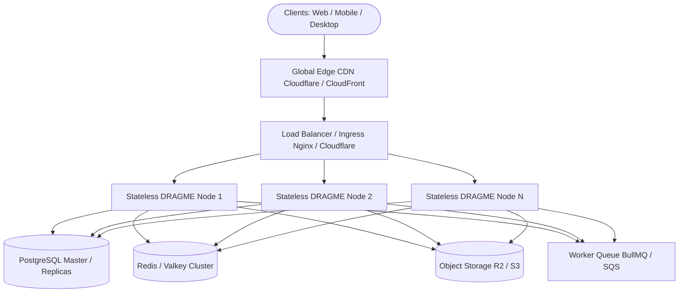

# 🚀 DRAGME — MASTER SCALABILITY, HOSTING & DEVELOPER STANDARD

> **System Vision:** Designed to run with zero setup for 1 user/developer, scale seamlessly to 100 Million+ users, deploy on 100% free hosting tiers or enterprise distributed clouds without rewriting code, and maintain crystal-clear simplicity whether built by 1 engineer or a team of 500.

---

## 🏛️ 1. SCALABILITY MATRIX (1 to 100,000,000 Users)

DRAGME follows a **Modular Stateless Monolith** architecture designed to evolve through 4 distinct scale tiers purely through configuration and infrastructure without changing application business logic:



### Scale Tiers Breakdown

| Scale Tier | Users | Infrastructure Stack | Database & Storage | Hosting Cost | Configuration |
| :--- | :--- | :--- | :--- | :--- | :--- |
| **Tier 0: Local / Dev** | 1 – 1,000 | Single Node.js process (`server.js`) | Embedded SQLite (WAL mode, memory mapped cache, temp store in memory) + Local disk storage (`/uploads`) | **$0 / month** | `DATABASE_URL=` (blank), `STORAGE_PROVIDER=local` |
| **Tier 1: Free Cloud** | 1,000 – 100,000 | Single container (Render / Railway / Fly.io / Koyeb) | Serverless PostgreSQL (Neon / Supabase free tier) + Cloudflare R2 (10GB free, 0 egress fees) | **$0 / month** | Set `DATABASE_URL` + Cloudflare R2 S3 credentials |
| **Tier 2: Scale Cloud** | 100k – 10,000,000 | Horizontal auto-scaling container cluster (AWS ECS / GCP Cloud Run / Kubernetes) behind CDN | Managed PostgreSQL Pool (`pg.Pool` with 30-100 connections) + Redis Cache for hot feeds/counters + S3/R2 + Async workers | **Pay-as-you-grow** | Add `REDIS_URL`, multiple app replicas |
| **Tier 3: Hyper Scale** | 10M – 100M+ | Multi-region Kubernetes cluster + Edge Workers | Sharded / Partitioned PostgreSQL + Read Replicas + PgBouncer (100k+ connections) + Distributed SQS/BullMQ worker fleet | **Enterprise** | Read/Write splitting, Regional caching |

---

## 🌍 2. HOSTING-AGNOSTIC BLUEPRINT (Free Tiers to Enterprise Cloud)

DRAGME has **zero vendor lock-in**. The entire application is 12-factor compliant and driven 100% by environment variables.

### Option A: 100% Free Hosting (Zero Cost)
1. **Compute:** [Render.com](https://render.com) (Free Web Service) or [Koyeb](https://koyeb.com) / [Fly.io](https://fly.io).
2. **Database:** [Neon.tech](https://neon.tech) (Free 0.5GB Serverless Postgres) or [Supabase](https://supabase.com) (Free 500MB Postgres).
3. **Media Storage:** [Cloudflare R2](https://www.cloudflare.com/developer-platform/r2/) (10GB free storage, **zero egress bandwidth fees**).
4. **Setup:** Set `DATABASE_URL` in your platform dashboard, deploy via GitHub repository link.

### Option B: High-Performance Docker / VPS ($5 - $20 / month)
1. Use the pre-built `Dockerfile` and `docker-compose.yml`:
```bash
# Start fullstack app + PostgreSQL container
docker compose up -d
```
2. Automated healthchecks (`/api/health`) ensure zero-downtime rolling updates.

### Option C: Enterprise Cloud (AWS / GCP / Azure / Kubernetes)
1. Deploy stateless Docker container to AWS ECS Fargate or GCP Cloud Run.
2. Connect to Amazon Aurora Serverless PostgreSQL / Cloud SQL.
3. Media assets automatically stream through Amazon CloudFront / Cloudflare CDN.

---

## 👥 3. DEVELOPER EXPERIENCE: 1 DEVELOPER TO 500 DEVELOPERS

To allow 1 to 500 developers to collaborate seamlessly without merge conflicts, code duplication, or spaghetti dependencies, DRAGME enforces a strict **4-Layer Domain-Driven Modular Monolith**:

```text
axh /
├── backend/
│   ├── routes/          # 1. URL routing & HTTP verb mapping (authRoutes, postRoutes, roomRoutes)
│   ├── validators/      # 2. Schema validation & input sanitization (authValidator, postValidator)
│   ├── controllers/     # 3. HTTP extraction, status codes, and serialization (authController, postController)
│   ├── services/        # 4. Pure Business Logic & Domain Orchestration (postService, authService, mediaService)
│   ├── repositories/    # 5. Data Access Layer / SQL Queries (userRepository, postRepository, mediaRepository)
│   ├── middleware/      # 6. Cross-cutting concerns (authMiddleware, rateLimiter, errorHandler)
│   └── utils/           # 7. Shared helpers (responseUtils, timeUtils)
│
├── services/            # Pluggable Compute Engines (mediaProcessor, storageService, mediaQueue)
├── config/              # Centralized environment & feature configurations
├── components/          # Frontend isolated UI components (navbar, feed, comments, profile, etc.)
└── tests/               # Automated Unit, Integration, and Regression test suites
```

### Inviolable Rules for Multi-Developer Teams

1. **Layer Boundary Rule:**
   - `Routes` call `Validators` & `Controllers`.
   - `Controllers` call `Services`.
   - `Services` call `Repositories` and other `Services`.
   - `Repositories` execute SQL queries via `db.js`.
   - **Never bypass layers** (e.g. Controllers must NEVER write raw SQL; Routes must NEVER contain business logic).

2. **Feature Isolation Rule:**
   - Post logic lives in `postService` / `postRepository`.
   - Reaction logic lives in `reactionService` / `reactionRepository`.
   - Modifying reaction logic will never introduce side-effects into user authentication or media pipelines.

3. **Universal API Response Envelope:**
   All endpoints must return standard responses via `backend/utils/responseUtils.js`:
   ```json
   // Success
   { "success": true, "data": { ... }, "meta": { "total": 10 } }

   // Error
   { "success": false, "error": "Human readable message", "code": "INVALID_INPUT", "status": 400 }
   ```

4. **Zero-Setup Developer Onboarding (60 Seconds):**
   ```bash
   # 1. Clone repository
   git clone <repo_url> && cd axh

   # 2. Install dependencies
   npm install

   # 3. Start local development (runs instantly on high-performance SQLite WAL)
   npm run dev

   # 4. Run automated test suite
   npm test
   ```

5. **Production Verification Standard:**
   - Every pull request must pass all automated test suites (`npm test`).
   - Run both SQLite and PostgreSQL tests to verify cross-engine compatibility.
